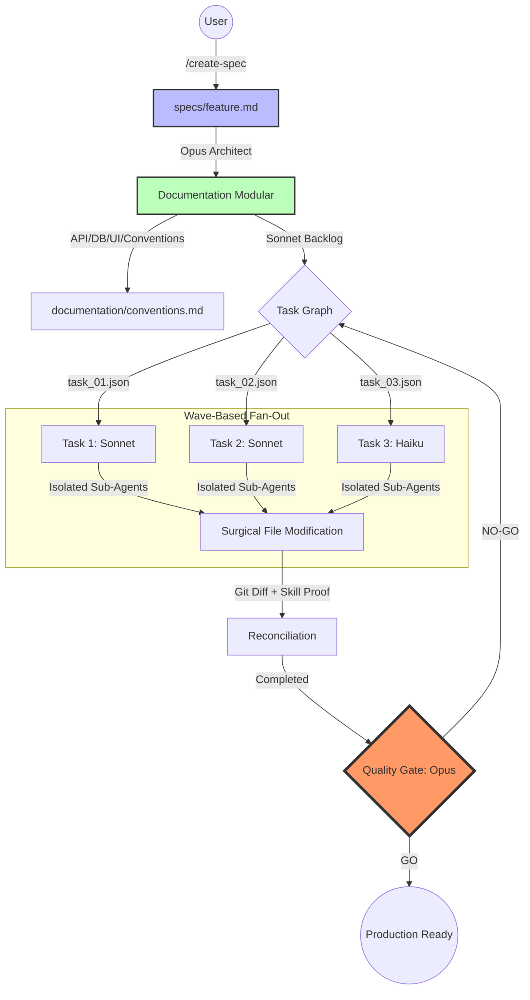

# The SDD Manifesto: Spec-Driven Development
> *Engineering Software at the Speed of Thought, with the Precision of Logic.*

## 1. The Thesis: Why Open Spec is Not Enough
Traditional **Open Specifications** (OpenAPI, AsyncAPI) were designed for humans to communicate with humans. In the era of Autonomous Agents, these specs suffer from **Context Inflation**: they are too broad for an agent to execute without "drifting" or hallucinating.

**SDD (Spec-Driven Development)** is the evolution. It is not just a documentation standard; it is an **Agent Orchestration Protocol** that treats specifications as executable governance.

---

## 2. The Three Pillars of SDD

### I. Surgical Context over Massive Context
Agents do not need *more* information; they need the *exact* information.
- **The Protocol:** Every task is bounded by a `file_scope` and a `read_architecture_section`. 
- **The Result:** We eliminate "Agent Drift" by forcing a tunnel-vision focus on the atomic task at hand.

### II. Token Governance (Model Discipline)
Intelligence must be proportional to the complexity of the task.
- **[ARCH_OPUS]** for Strategy & Security.
- **[DEV_SONNET]** for Logic & Implementation.
- **[DOC_HAIKU]** for Speed & Utility.
Using a high-reasoning model for boilerplate is a technical debt; using a low-reasoning model for architecture is a failure.

> **A note on honesty:** Claude Code cannot switch a session's model mid-run, so this is **discipline guided by the protocol, not magic auto-switching.** Main-thread phases run on the model you select with `/model`; a genuine per-task model override only applies to the **Phase 3 sub-agent fan-out** via the Task tool's `model` parameter. The recommendation stands — the enforcement is partly yours.

### III. Verification over Trust
In SDD, a task is not "done" because the agent says so. It is "done" when the **Quality Gate** proves it.
- **Skill Confirmation:** Every execution must be signed with a `[SKILL-CONFIRMATION]` marker.
- **Pointer Integrity:** We validate that the code points back to the architecture, ensuring the Spec and the Code never diverge.

---

## 3. The SDD Workflow Architecture

---

## 4. SDD vs. Traditional AI Development

| Feature | Generic AI Dev | **SDD Protocol** |
| :--- | :--- | :--- |
| **Context Management** | Full Project (Wasteful) | Surgical Scope (Efficient) |
| **Architecture** | Implicit / Accidental | Explicit / Contract-First |
| **Model Usage** | Monolithic (One size fits all) | Model discipline (Opus/Sonnet/Haiku) — auto only in Phase 3 sub-agents; main thread set via `/model` |
| **Validation** | Manual Review | Multi-Stage Automated Gate |
| **Scalability** | High Failure Rate on complexity | Linear Scalability via Parallel Waves |
| **Token Cost** | Exponential Growth | Optimized (Prompt Caching + Routing) |

---

## 5. The Golden Rule of SDD
> **"Never implement what has not been designed; never design what has not been specified; never release what has not been verified."**

SDD is more than a toolset; it is a commitment to **Architectural Integrity**. We stop "fixing bugs" and start "enforcing specifications".

---

## 6. How to Join the Protocol
To implement SDD in your project, you must adopt the core commands:
1. `/create-spec`: Capture the value.
2. `/sdd-plan`: Design the modularity (Opus).
3. `/sdd-execute`: Build it in parallel (Sonnet).
4. `/sdd-quality-gate`: Enforce the standard.

---
*Created and maintained by the SDD Core Team.*
